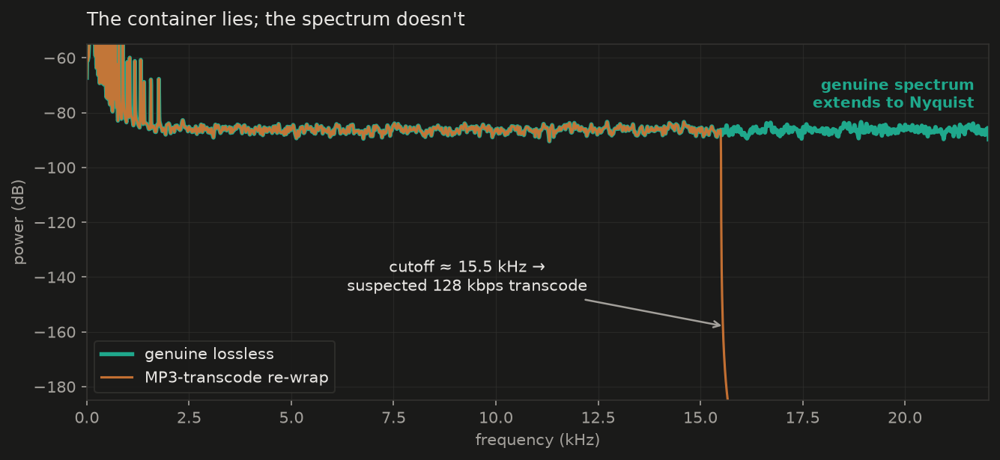

# audio-integrity-toolkit

[](https://github.com/hycccc/audio-integrity-toolkit/actions)
[](LICENSE)
[](pyproject.toml)

Acceptance-gate QC for audio datasets — the three checks a music-data ingestion pipeline runs on every delivery: **dedup** (exact + spectral-fingerprint near-duplicates), **metadata–audio matching**, and **fake-lossless detection** (plus clipping and dynamic range).



When you source audio at scale, deliveries lie in three ways: the *same recording* arrives twice under different names or containers; the *paperwork* (extension, header, duration) disagrees with the signal; and "lossless" files are lossy transcodes re-wrapped in a FLAC/WAV container. This tool implements the acceptance-gate pattern I use for music-dataset ingestion — one check per lie, each cheap enough to run on every file, strict enough to catch the defects that poison a training set.

```bash
audio-check       <files-or-dirs>   # spectral integrity gate (fake-lossless, clipping, DR)
audio-check dedup <files-or-dirs>   # exact + near-duplicate clusters
audio-check meta  <files-or-dirs>   # metadata–audio consistency
```

## `audio-check` — the spectral gate

1. **Spectral cutoff analysis** — compute the Welch PSD of the (downmixed) signal and locate the highest frequency with energy above a relative −80 dB floor. Lossy encoders apply characteristic low-pass filters, so a "FLAC" whose spectrum stops near 16 kHz was almost certainly an MP3 128 kbps once:

   | Observed cutoff | Verdict |
   |---|---|
   | < ~16.5 kHz | suspected MP3 128 kbps transcode |
   | < ~19.5 kHz | suspected MP3 192 kbps transcode |
   | < ~20.5 kHz | suspected MP3 320 kbps / AAC transcode |
   | within 1.5 kHz of Nyquist | genuinely full-band |

2. **Clipping detection** — count samples at ≥ 0.999 full scale.
3. **Dynamic-range estimate** — peak, RMS, and crest factor (peak − RMS), a quick proxy for over-compressed masters.

## `audio-check dedup` — duplicate clusters

Two tiers, because ingestion needs both:

- **Exact** — a SHA-256 of the *decoded PCM*, not the file bytes, so the same master shipped as WAV by one vendor and FLAC by another is caught as one song.
- **Near** — a compact spectral fingerprint (log-spaced band energies, delta-coded over time into per-frame bit patterns — the idea behind Chromaprint, in ~60 lines). Level changes, re-encodes, and light processing survive the exact tier; they don't survive this one. Alignment tolerates a few frames of leading-silence offset.

```
$ audio-check dedup vendor_batch_07/
[DUP exact]
  vendor_batch_07/track_a.wav
  vendor_batch_07/track_a_master.flac
[DUP near 91%]
  vendor_batch_07/track_b.wav
  vendor_batch_07/track_b_v2.wav
```

Clustering has two strategies (`--strategy`, default `auto`): **pairwise** compares every pair — exact, right for a delivery batch — and **indexed** buckets fingerprints with an inverted index first, the library-scale path. Index keys are frame words quantized to their top 12 bits, and only each file's 32 smallest keys are indexed (a bottom-k sketch), so full-length songs don't flood the buckets; a pair is compared only when the sketches share ≥2 keys. The index is a recall filter, never a judge — every candidate still faces the same `similarity()` threshold, so a bucket collision can waste compute but cannot invent a duplicate. On a 105-file synthetic batch with 5 planted near-dups, the index pruned 77% of comparisons and produced clusters identical to pairwise, 5/5. `auto` switches to the index past 64 files.

## `audio-check meta` — metadata–audio matching

The audio and its metadata come from different systems, and disagree constantly. Deterministic per-file checks: container format vs extension (the bytes win), header duration vs decoded duration (truncated transfers), leading/trailing silence (sloppy cuts that break lyric/annotation alignment downstream), nonstandard sample rates and channel layouts (conversion accidents).

```
$ audio-check meta vendor_batch_07/
[FAIL] vendor_batch_07/padded.wav
  WAV (.wav) · 44100 Hz · 1 ch · 11.00s
  - leading silence: 3.0s
[PASS] vendor_batch_07/track_a.wav
  WAV (.wav) · 44100 Hz · 1 ch · 8.00s
```

Every command emits `--json` (one object per line) and a non-zero exit code on any failure, so all three drop straight into CI or an ingestion pipeline.

## Install

```bash
pip install git+https://github.com/hycccc/audio-integrity-toolkit
```

## Usage

```bash
# single file, human-readable
audio-check song.flac

# whole delivery batch, one JSON object per file (pipe into your pipeline)
audio-check /data/vendor_batch_07/ --json > batch_07_qc.jsonl
```

Exit code is non-zero if any file fails the gate, so it drops straight into CI or an ingestion pipeline.

Example output:

```
[FAIL] song.flac
  44100 Hz · 2 ch · 213.40s · PCM_16
  peak -0.10 dBFS · rms -9.83 dBFS · crest 9.73 dB · clipped samples 412
  spectral cutoff 16021 Hz / Nyquist 22050 Hz
  verdict: suspected MP3 128kbps transcode
```

As a library:

```python
from audio_integrity import analyze

report = analyze("song.flac")
if not report.lossless:
    quarantine(report.path, reason=report.verdict)
```

## Limitations — use as a guardrail, not as gold

Spectral cutoff is a heuristic. Some genuine recordings are naturally band-limited (dark analog masters, archival material), and some modern encoders keep more highs than their bitrate suggests. In production I treat this check the way I treat every automated audio metric: **a guardrail that catches obvious defects at scale, with human spot-checks as the gold standard.** Flag, quarantine, and sample-listen — don't silently delete.

## License

MIT
